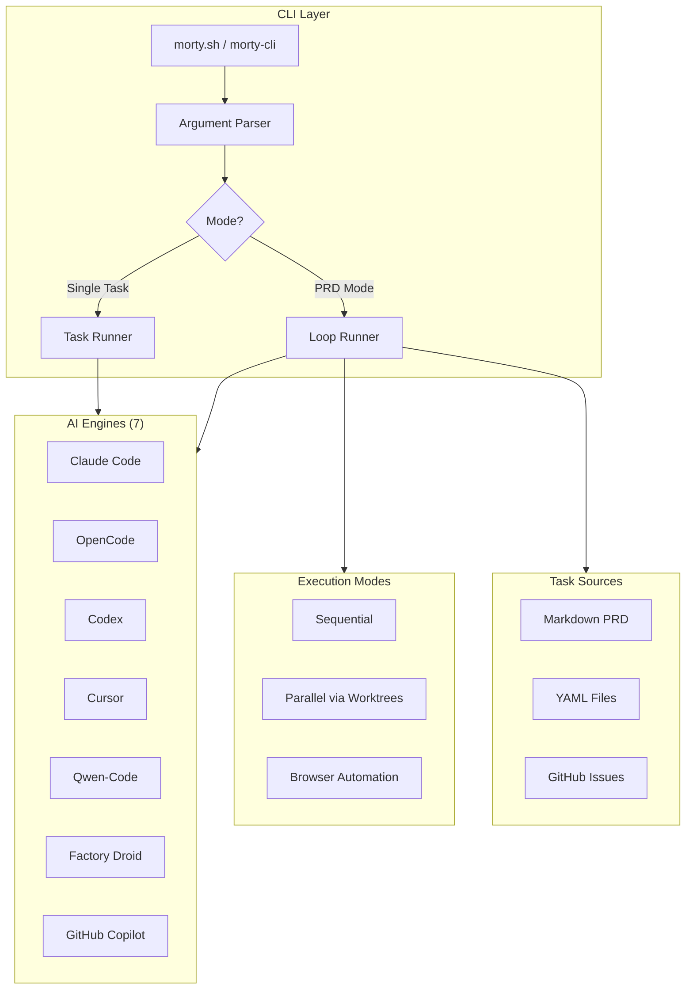
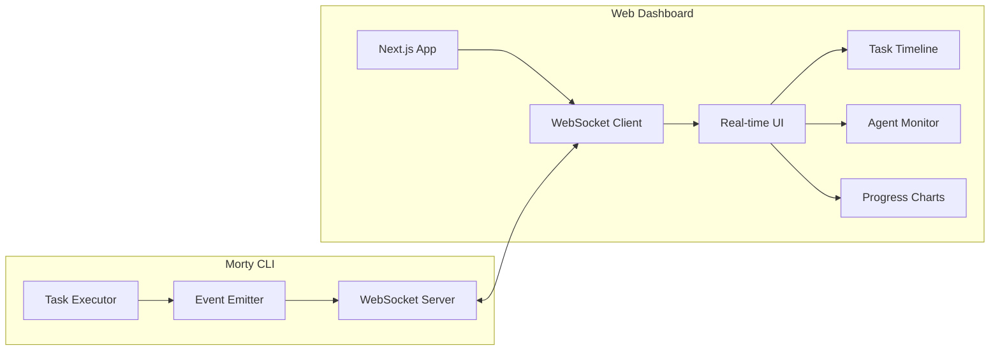
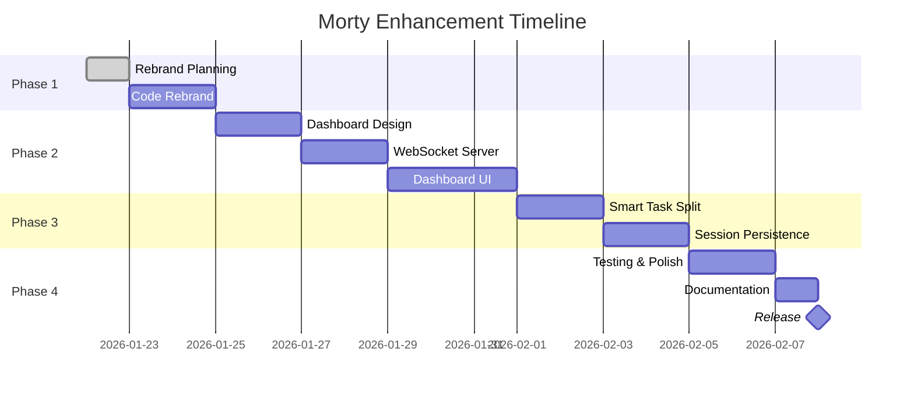

# Morty - Rebrand & Web Dashboard Enhancement Plan

> Transform Ralphy into Morty with a modern real-time web dashboard for vibecoders

---

## Executive Summary

This plan covers the comprehensive rebrand of **Ralphy** to **Morty**, plus the addition of a **real-time web dashboard UI** that allows vibecoders to monitor agent activity, track tasks, and visualize progress. Additionally, we propose **10+ new features** to enhance the vibecoding experience.

---

## User Review Required

> [!IMPORTANT]
> **Naming Confirmation**: The rebrand changes `ralphy` → `morty` throughout the codebase. Please confirm this naming decision before implementation.

> [!WARNING]
> **Breaking Changes**: Existing users with `.ralphy/` config directories will need to migrate to `.morty/`. We can add an auto-migration script.

> [!CAUTION]
> **NPM Package Name**: The current package is `ralphy-cli`. A new package `morty-cli` will need to be published. The old package should be deprecated with a message pointing to the new one.

---

## Current Project Analysis

### Architecture Overview



### Current File Structure

```
morty/
├── ralphy.sh              # Bash script entry (3119 lines)
├── cli/                   # TypeScript CLI
│   ├── src/
│   │   ├── engines/       # 7 AI engine integrations
│   │   ├── execution/     # Sequential, parallel, browser
│   │   ├── tasks/         # Markdown, YAML, GitHub sources
│   │   ├── git/           # Branch, worktree, merge logic
│   │   ├── config/        # .ralphy/ loader
│   │   └── ui/            # Logger, spinner, notify
│   └── package.json       # ralphy-cli v4.4.0
├── landing/               # Next.js landing page
│   ├── app/
│   └── components/        # Header, Hero, Features, etc.
└── README.md              # Current documentation
```

### Current Features

| Feature                | Description                                           |
| ---------------------- | ----------------------------------------------------- |
| **Single Task Mode**   | `morty "add dark mode"`                               |
| **PRD Loop Mode**      | Processes markdown/YAML task lists                    |
| **7 AI Engines**       | Claude, OpenCode, Codex, Cursor, Qwen, Droid, Copilot |
| **Parallel Execution** | Up to 5 agents in isolated worktrees                  |
| **Branch Workflow**    | Auto-branching, PRs, conflict resolution              |
| **Browser Automation** | Integration with agent-browser                        |
| **Project Config**     | `.ralphy/config.yaml` for rules and settings          |

---

## Proposed Changes

### Component 1: Rebrand (Ralphy → Morty)

#### [MODIFY] [package.json](file:///Users/codewithabdul/LockeIn/morty/cli/package.json)

- Change `name` from `ralphy-cli` to `morty-cli`
- Update `bin` entry from `ralphy` to `morty`
- Update repository URL
- Update description

#### [MODIFY] [ralphy.sh → morty.sh](file:///Users/codewithabdul/LockeIn/morty/ralphy.sh)

- Rename file to `morty.sh`
- Update internal variables (`RALPHY_DIR` → `MORTY_DIR`)
- Update config file paths
- Update branding in help text

#### [MODIFY] [README.md](file:///Users/codewithabdul/LockeIn/morty/README.md)

- Replace all "Ralphy" references with "Morty"
- Update install commands
- Update usage examples
- Update assets/images

#### [MODIFY] Config Loader Files

- `cli/src/config/loader.ts` - Update directory constants
- `cli/src/config/writer.ts` - Update paths
- All internal references throughout `cli/src/`

#### [MODIFY] Landing Page

- `landing/components/header.tsx` - Update branding
- `landing/components/hero.tsx` - Update title/description
- `landing/app/page.tsx` - Update JSON-LD schema

---

### Component 2: Web Dashboard UI (NEW)

This is the core new feature - a real-time web interface for monitoring Morty's activity.



#### [NEW] `dashboard/` - Next.js Web Dashboard Application

**Technology Stack:**

- Next.js 15 (App Router)
- Tailwind CSS v4
- WebSocket for real-time updates
- Zustand for state management
- Framer Motion for animations
- Recharts for visualizations

**Pages:**
| Route | Purpose |
|-------|---------|
| `/` | Dashboard home - current session overview |
| `/tasks` | All tasks with filtering and search |
| `/history` | Past sessions and completed work |
| `/settings` | Dashboard configuration |

**Key Components:**

- **TaskTimeline** - Real-time activity log
- **AgentMonitor** - Current agent status (thinking, reading, writing, testing)
- **ProgressRing** - Visual completion percentage
- **TokenCounter** - Running token usage
- **CostEstimator** - Real-time cost tracking
- **CodeDiff** - Show what files are being changed
- **LogViewer** - Raw output stream

#### [NEW] `cli/src/server/` - WebSocket Server Module

```
cli/src/server/
├── index.ts          # Server entry point
├── websocket.ts      # WebSocket handler
├── events.ts         # Event types and emitter
└── state.ts          # Shared state manager
```

**Events Emitted:**
| Event | Data | Description |
|-------|------|-------------|
| `task:start` | `{id, title, timestamp}` | Task begins |
| `task:complete` | `{id, title, result, tokens}` | Task finished |
| `task:fail` | `{id, title, error}` | Task failed |
| `step:update` | `{step, description}` | Current step changed |
| `file:read` | `{path}` | AI reading file |
| `file:write` | `{path, diff?}` | AI writing file |
| `command:run` | `{command}` | Shell command executed |
| `tokens:update` | `{input, output, cost}` | Token count updated |

#### [MODIFY] CLI Entry Point

Add `--dashboard` flag to start the web server:

```bash
morty --dashboard              # Start dashboard on default port (3847)
morty --dashboard --port 4000  # Custom port
morty "task" --dashboard       # Run task with dashboard
```

---

### Component 3: Feature Enhancements

#### Priority 1: Core Experience

| Feature                     | Description                           | Benefit                                   |
| --------------------------- | ------------------------------------- | ----------------------------------------- |
| **🎯 Smart Task Splitting** | AI breaks complex tasks into subtasks | Faster completion, better parallelization |
| **🔄 Session Persistence**  | Save/resume incomplete sessions       | No lost work on interruption              |
| **📊 Analytics Dashboard**  | Historical stats, cost tracking       | Budget awareness                          |
| **🎨 Custom Themes**        | Light/dark + custom color schemes     | Personalization                           |

#### Priority 2: Developer Experience

| Feature                | Description                      | Benefit                  |
| ---------------------- | -------------------------------- | ------------------------ |
| **🔌 Plugin System**   | Extend Morty with custom scripts | Community extensions     |
| **📝 Task Templates**  | Pre-defined task patterns        | Faster task creation     |
| **🔗 MCP Integration** | Connect to MCP servers           | Extended AI capabilities |
| **🎙️ Voice Commands**  | Dictate tasks via microphone     | Hands-free coding        |

#### Priority 3: Team Features

| Feature               | Description                        | Benefit       |
| --------------------- | ---------------------------------- | ------------- |
| **👥 Team Mode**      | Share sessions, multiplayer coding | Collaboration |
| **📤 Export Reports** | Generate PDFs of completed work    | Documentation |
| **🔔 Notifications**  | Slack/Discord integration          | Stay informed |
| **☁️ Cloud Sync**     | Sync config across machines        | Portability   |

---

### Detailed Feature Specifications

#### Feature: Smart Task Splitting

When Morty receives a complex task, it will:

1. **Analyze** the task for complexity markers
2. **Propose** a breakdown into subtasks
3. **Present** the plan to the user (optional skip with `--auto-split`)
4. **Execute** subtasks in optimal order

```bash
# Example
morty "build a complete e-commerce checkout flow"

# Morty suggests:
# 🧩 Task Split Proposal:
#   1. [ ] Create checkout page layout
#   2. [ ] Add payment form component
#   3. [ ] Integrate Stripe API
#   4. [ ] Add order confirmation page
#   5. [ ] Write tests
#
# Proceed? [Y/n]
```

#### Feature: Session Persistence

```bash
morty "build feature X" --session my-feature
# Runs until interrupted (Ctrl+C) or complete

morty --resume my-feature
# Picks up where it left off

morty --list-sessions
# Shows all saved sessions
```

Session data stored in `.morty/sessions/`:

```yaml
# .morty/sessions/my-feature.yaml
id: my-feature
started: 2026-01-22T08:00:00Z
status: paused
tasks_completed: 3
tasks_remaining: 2
last_task: "Create checkout page"
context:
  branches: [morty/task-1, morty/task-2]
  tokens_used: 45000
```

#### Feature: Plugin System

```bash
# Install a plugin
morty plugin install morty-plugin-jira

# Use it
morty --jira PROJECT-123  # Fetch task from Jira

# List plugins
morty plugin list
```

Plugin structure:

```
morty-plugin-jira/
├── package.json        # Plugin metadata
├── index.ts            # Main entry
└── commands/
    └── jira.ts         # Command handler
```

---

## Implementation Timeline



---

## Verification Plan

### Automated Tests

```bash
# Unit tests for new features
bun test cli/src/**/*.test.ts

# E2E tests for dashboard
bun test:e2e dashboard/

# Integration tests for WebSocket
bun test cli/src/server/**/*.test.ts
```

### Manual Verification

| Test                  | Steps                   | Expected Result                |
| --------------------- | ----------------------- | ------------------------------ |
| **Rebrand**           | Run `morty --help`      | Shows Morty branding           |
| **Dashboard Launch**  | Run `morty --dashboard` | Opens web UI on localhost:3847 |
| **Real-time Updates** | Run task with dashboard | UI updates live                |
| **Task Split**        | Run complex task        | Morty proposes breakdown       |
| **Session Resume**    | Interrupt and resume    | Continues from checkpoint      |

---

## Questions for User

Before proceeding, please confirm:

1. **Branding**: Is "Morty" the final name? Any tagline preferences?
2. **Dashboard Priority**: Should the dashboard be Phase 2 priority, or should we complete all rebrand tasks first?
3. **Feature Prioritization**: Which of the proposed features are most important to you?
4. **Design Style**: Any specific aesthetic preferences for the dashboard (glassmorphism, gradients, minimal)?
5. **Backward Compatibility**: Should we support automatic migration from `.ralphy/` to `.morty/`?
